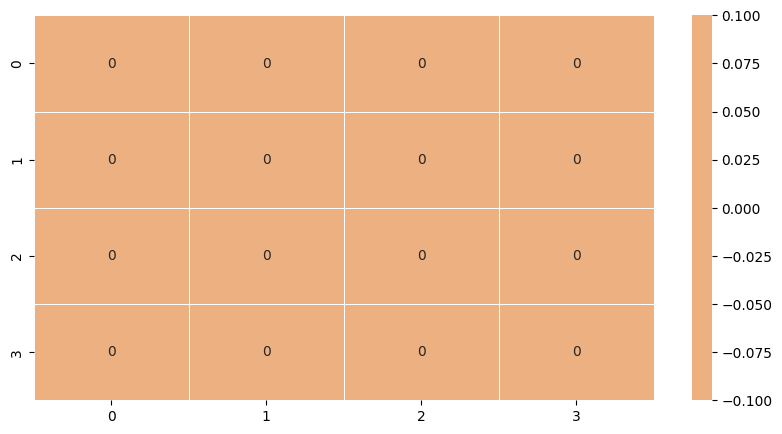
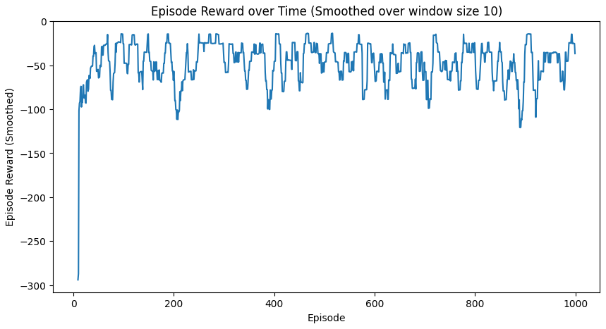
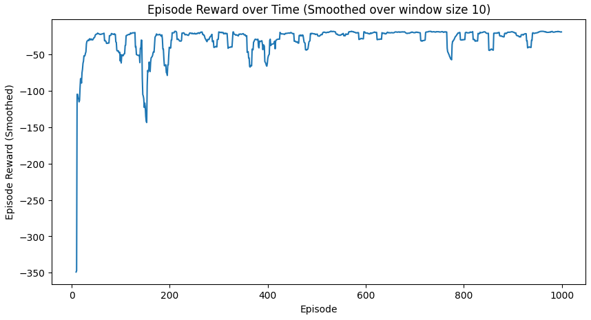

[TOC]


### 杂项

常用依赖安装指令

```bash
pip install -r requirements/requirements.txt
```

创建本地虚拟环境

```bash
uv venv
```

或者直接用`python`启动,独立于shell

```bash
python -m uv run python ppo.py
```

`isinstance`的另一个用法

```python
assert isinstance(envs.single_action_space, gym.spaces.Discrete)
```

`with`逻辑意味着保持某个判断为真

```python
with torch.no_grad():
```

一张全零的$V$表意味着智能体从未到达过终点, 如果只有到达终点有奖励.



`array`按`column`或`row`计算

```python
policy = np.zeros([num_state, num_action])
policy[:, 0] = 1
```

这和`Tensor`中的`reshape(-1)`类似,即只保留某个维度,其余维度展平.

## gymnasium

对于任何模型,优先`query`它的`action_space`和`observation_space`.

> Every environment specifies the format of valid actions and observations with the [`action_space`](https://gymnasium.farama.org/api/env/#gymnasium.Env.action_space) and [`observation_space`](https://gymnasium.farama.org/api/env/#gymnasium.Env.observation_space) attributes. 

`gym`中用于执行随机策略的函数是

```python
if not policy:
    action = lambda _: env.action_space.sample()
```

也有`restricted_policy`,限制策略本质上是限制策略对应的`index`.注意`action_space.n`表示全体合法行动数量.

```python
if self.restricted_policy is None:
    return lambda _:np.random.randint(self.env.action_space.n//2)
```

After receiving our first observation from `env.reset()`, we use `env.step(action)` to interact with the environment.

```
observation, reward, terminated, truncated, info = env.step(action)
```

- **`observation`**: What the agent sees after taking the action (new game state)
- **`reward`**: Immediate feedback for that action (+1, -1, or 0 in Blackjack)
- **`terminated`**: Whether the episode ended naturally (hand finished)
- **`truncated`**: Whether episode was cut short (time limits - not used in Blackjack)
- **`info`**: Additional debugging information (can usually be ignored)

### 训练逻辑`ppo.py`

1. 准备环境张量`tensor`.

   ```python
   rewards = torch.zeros((args.num_steps, args.num_envs)).to(device)
   ```

   对应$r(s_t^i,a_t^i)$, 分为时间步维度$T$以及并行环境数量$N$.参考
   $$
   \nabla_{\theta}J(\theta)\rightarrow\frac{1}{N}\sum^N_{n=1}\left(\sum^T_{t=1} \ln\nabla_\theta \pi_\theta(a_t|s_t) \right)G_t
   $$

   > 也就是说, $N$个蒙特卡洛采样可以并行发生. 包括环境信息采样并行和公式计算并行 :smile:.

2. `anneal`退火处理
   $$
   f=1-\frac{i-1}{N}
   $$

   $$
   \alpha\leftarrow f\cdot \alpha
   $$

3. `global_step`的作用仅仅是`Timestamp`吗? :thinking:.​
   可用于表示环境总交互量,和训练数据量直接挂钩, 是固定的训练*成本*上限.

   ```python
   for step in range(0, args.num_steps):
               global_step += args.num_envs
               obs[step] = next_obs
               dones[step] = next_done
   ```

   [异步更新]注意这里是`post update`, 在`step 1`计算出的`step 2`的值`obs`,`done`,要等到`step 2`才能记录. 所以`terminal`的`next_obs`和`next_done`都是"游离状态". 

4. 进行训练.

   ```python
   with torch.no_grad():
       action, logprob, _, value = agent.get_action_and_value(next_obs)
       values[step] = value.flatten()
   actions[step] = action
   logprobs[step] = logprob
   ```

   ```python
   next_obs, reward, terminations, truncations, infos = env.step(action.cpu().numpy()) # 回传CPU
   next_done = np.logical_or(terminations, truncations)
   rewards[step] = torch.tensor(reward).to(device).view(-1)
   ```

   ```python
   next_obs, next_done = torch.Tensor(next_obs).to(device), torch.Tensor(next_done).to(device)
   ```

   

5. GAE广义优势估计

   ```python
   with torch.no_grad():
       next_value = agent.get_value(next_obs).reshape(1, -1)
       advantages = torch.zreos_like(rewards).to(device)
       lastgaelam = 0
   ```

   ```python
   for t in reversed(range(args.num_steps)):
       if t == args.num_steps - 1: # 受上文post update逻辑影响
           nextnonterminal = 1 - next_done
           nextvalues = next_value
       else:
           nextnonterminal = 1 - dones[t + 1]
           nextvalues = values[t + 1]
       delta = rewards[t] + args.gamma * nextvalues * nextnonterminal -values[t] # TD error
       advantages[t] = lastgaelam = delta + args.gamma * args.gae_lambda * nextnonterminal * lastgaelam
   ```

   主要依赖TD error (单步估计)
   $$
   \delta_t=r_t+\gamma V(s_{t+1})-V(s_t)
   $$
   以及对不同步数的优势估计做加权平均
   $$
   \hat{A}_t^{GAE}=\delta_t+(\gamma\lambda)\delta_{t+1}+(\gamma\lambda)^2\delta_{t+2}+...
   $$
   为了方便计算, 采用*逆势回击*, 更新公式为
   $$
   A_t=\delta_t+\gamma\lambda\cdot lastgaelam
   $$

   $$
   lastgaelam\leftarrow A_t
   $$

   `advantages`是相对优势的度量,注意公式
   $$
   \nabla_\theta J(\theta)=\mathbb{E}_{\pi_\theta}[\nabla_\theta\ln\pi_\theta(s_t,a_t)\hat{A}_t^{GAE}]
   $$

   $$
   \theta\leftarrow \theta+\alpha\nabla_\theta J(\theta)
   $$

   提升更新效率,追求*比预期更好*.

   > `bias`和`variance`的区别:采样越少,偏差越大,方差越小. 反之亦然. $\lambda\in[0,1]$,PPO在高方差与高偏差之间做平衡.

   最后计算每个$t$时刻的$G_t$.

   ```python
   returns = advantages + rewards
   ```

   注意三个变量均为`Tensor`.

6. `tensor`创建与克隆

   ```python
   values = torch.zeros((args.num_steps, args.num_envs)).to(device)
   actions = torch.zeros((args.num_steps, args.num_envs) + envs.single_action_space.shape).to(device) # 注意这里创建参数
   advantages = torch.zero_like(rewards).to(device)
   ```

   这里的`+`号对应元组拼接,表示最终结果的第一维是`batch`序号,后面保持原本的维度不变.

7. `batch`处理

   ```python
   b_inds = np.arange(args.batch_size)
   ```

   ```python
   for epoch in range(args.update_epoch):
        np.random.shuffle(b_inds)
   ```

   ```python
   for start in range(0, args.batch_size, args.minibatch_size):
       end = start + minibatch_size
       mb_inds = b_inds[start : end]
       
       _, newlogprob, entropy, newvalue = agent.get_action_and_value(b_obs[mb_inds], b_actions.long()[mb_inds])
       logration = newlogprob - b_logprobs[mb_inds]
       ration = logration.exp()
   ```

   将`array`扔进张量中等于扔进去一张index表. 注意算法设计:先随机排序`np.random.shuffle`,再顺序取,避免重复取到同一个样本.
   `agent.get_action_and_value`是如何工作的? :thinking:

8. `approx_kl`

   ```python
   with torch.no_grad():
       old_approx_kl = (-logratio).mean()
       approx_kl = ((ratio - 1) - logratio).mean()
       clipfracs += [((ratio - 1.0).abs() > args.clip.coef).float().mean().item()]
   ```

   似乎是用于提前终止当前`epoch`训练的. (一个`epoch`最多更新这么多), 其中$p(x),q(x)$分别是新策略,旧策略.
   $$
   KL[q,p]=E_{q(x)}[\log\frac{q(x)}{p(x)}]
   $$
   An estimator can be
   $$
   KL[q,p]:(r-1)-\log r,\ \ \ r=\frac{p(x)}{q(x)}
   $$
   想起来信息论里面学过的$D(q||p)$.实际上简单的`env.clip_coef`应该就够用,本质上是限制策略更新速度.

   > $D(q||p)$在信息论中是relative entropy, *a distance between distributions*.这是*非对称*的,衡量$q$相对于$p$的信息变化量.

9. 归一化`advantages`

   ```python
   mb_advantages = b_advantages[mb_inds]
   if args.norm_adv:
       mb_advantages = (mb_advantages - mb_advantages.mean()) /(mb_advantages.std() + 1e-8)
   ```

   $$
   \hat A=\frac{A-\bar A}{\sigma_A+\epsilon}
   $$

10. `policy_loss`:Clipped Surrogate Objective

   ```python
   pg_loss1 = -mb_advantages * ratio
   pg_loss2 = -mb_advantages * torch.clamp(ratio, 1 - args.clip_coef, 1 + args.clip_coef)
   pg_loss = torch.max(pg_loss1, pg_loss2).mean()
   ```

   防止张量过大更新太快. 这里所有的`mean()`都只是基于不同`minibatch`结果的平均,旨在减小误差,不具有数学意义.

11. `value_loss` 

   ```python
   newvalue = newvalue.view(-1)
   v_loss = 0.5 * ((newvalue - b_returns[mb_inds]) ** 2).mean()
   ```

11. `loss` 结合`entropy_loss`

    ```python
    entropy_loss = entropy.mean()
    loss = pg_loss - args.ent_coef * entropy_loss + value_loss * args.vf_coef
    ```

    $$
    \mathbb{L}_{total}=\mathbb{L}_{pg}-c_{entropy}\mathbb{L}_{entropy}+c_{value}\mathbb{L}_{value}
    $$

12. `optimizer`.

    ```python
    optimizer.zero_grad()
    loss.backward()
    nn.utils.clip_grad_norm_(agent.parameters(),args.max_grad_norm)
    optimizer.step()
    ```

    > 1. 清空梯度
    > 2. 反向传播
    > 3. 裁剪梯度
    > 4. 更新参数

#### PPO 和 Q-learning

1. 都是`off-policy`.都根据策略$A$更新策略$B$.
2. PPO需要重要性采样 $r=p(x)/q(x)$来修正policy distribution. 采样一次,训练多次`epoch`.
3. Q Learning的目标策略$B$是隐式的,只有在最终Q表更新完成后才会一步更新.(在实践中,时刻追逐$\max$容易被噪声干扰).

#### PPO特点

先采样一次`logprobs`,后续通过importance sampling把旧策略产生的数据用于估计新策略的梯度,并反复更新直到relative entropy达到`args.target_kl`的阈值. 每一轮`iteration`结束后,旧数据会被彻底丢弃,并以当前最新的$\pi$重新采样.
$$
Sampling\to Batching\to Updating\to Sampling
$$

## Monte Carlo

$G_t$表示$t\to T$的所有discounted rewards.
$$
G_t=\sum_{k=0}^{T-t-1}\gamma^kR_{t+1+k}
$$
RL作业中`termination function`$\gamma(S_t)$对应的变体是
$$
G_t=\sum_{k=0}^{T-t-1}(\prod_{i=0}^k\gamma(S_{t+k}))R_{t+k+1}
$$
一个有趣的公式(我之前从来没见过)
$$
V(s)=\frac{\sum_{t=1}^T\bold 1[S_t=s]G_t}{\sum_{t=1}^T\bold 1[S_t=s]}
$$
这是所谓的`every visit`,也就是$t\to T$中只要遇到$s$,就加入平均值计算中.

### 训练逻辑`dqn.py`

1. `ReplayBuffer`

   ```python
   rb = ReplayBuffer(args.buffer_size, envs.single_observation_space, envs.single_action_space, device, handle_timeout_termination=False)
   ```

   联想到`ppo.py`中利用$\pi_{old}$产生的`b_obs[md_inds]`和`b_actions.long()[mb_inds]`传入`agent.get_action_and_value`中以获取新的`newlogprob`.

   然而`rb`可以添加初始化时没有的元素 :laughing:. 这个初始化实际上是传递特殊的`observation_space` `action_space`的维度,其他的就用`(num_step, num_env)`就可以了.

   ```python
   rb.add(obs, real_next_obs, actions, rewards, terminations, infos) # 所有参数均为ndarray,表示并行envs
   ```

2. 计算$\epsilon$-greedy policy.

   ```python
   epsilon = ...
   if np.random.random() < epsilon: ...
   else:
       q_values = q_network(torch.Tensor(obs).to(device))
       actions = torch.argmax(q_values, dim=1).cpu().numpy()
   ```

   注意`obs`的初始化和更新: (实际上在Q-Learning那里已经吃了一次亏了)

   ```python
   obs, _ = envs.reset(seed = args.seed)
   for global_step in range(args.global_total_timesteps):
       ...
   rb.add(...)
   obs = next_obs
   ```

3. 计算$TD\ loss$​.
   $$
   Q(S_t,A_t)\leftarrow Q(S_t,A_t)+\alpha(R_{t+1}+\gamma\max_a Q(S_{t+1},a)-Q(S_t,A_t))
   $$
   本质上需要知道下一个`next_observation`才能使用$\max$算子.

   ```python
   data = rb.sample(args.batch_size)
   with torch.no_grad():
       target_max, _ = target_network(data.next_observations).max(dim=1)
       td_target = data.rewards.flatten() + args.gamma * target_max * (1 - data.dones.flatten())
   old_val = q_network(data.observations).gather(1, data.actions).squeeze()
   ```

   `QNetwork`从哪里冒出来能够接收`Tensor`的函数? :thinking:.​

   ```python
   loss = F.mse_loss(td_target, old_val)
   ```

$DQN$算法的`ReplayBuffer`是不断膨胀的,没有显式维护`observations`序列,因为所有的样本均为随机采样 `data = rb.sample(args.batch_size)`.


### RL Assignment(1/2)

`policy`是$[state,action]\to R_{[0,1]}$的函数.

`random_policy`

```python
policy = None
num_state = env.observation_sapce.n
num_action = env.action_space.n
policy = np.ones([num_state, num_action]) / num_action
```

$$
\sum_{a\in A}\pi(a|S)=1
$$

Tips:这其实符合$MECE$的商业分析原则,不重不漏.

`env.P[state][action]`和`env.step(action)`对比

```python
prob, next_state, reward, termination = env.P[state][action]
next_state, reward, termination, truncation, info = env.step(action)
```

$Transition$状态转移矩阵额外提供一个状态转移概率,使得$DP$分析成为可能. 

`delta` control, 控制$V$表收敛.

```python
while True:
    delta = 0
    for state in range(env.observation_space.n):
        ...
    	delta = max(delta, abs(V[state] - v))
    if delta < theta:
        break
```

`policy_stable` control,控制$\pi$更新.

```python
while True:
    policy_stable = True
    V = policy_evaluation(policy, env, gamma, theta)
    for state in range(nS):
        old_policy = np.argmax(policy[state])
        new_policy = np.argmax(Q[state])
        if old_policy != new_policy:
            policy_stable = False
        policy[state, :] = 0
        policy[state, new_policy] = 1
    if policy_stable:
        break
```

policy iteration的流程是
$$
Evaluation\to \arg\max Q\to Update
$$
`value iteration`原理类似,只不过在`delta` control下改成$\max$算子.

```python
for s in range(nS):
    Q[state] = one_step_lookahead(s,V, env, gamma)
    best_value = np.max(Q[state])
    delta = np.max(delta, np.abs(best_value - V[s]))
    V[s] = best_value # 不要忘记更新了
```

Asynchronous Value Iteration是什么? :thinking:. 好吧,实际上上面这个`block`就是. 同步更新要等到所有$V$值计算完成后才会更新, 要维护$V_{new}$和$V_{old}$两张表.​

`episode`由`[state, action, reward, next_state]`构成. 

#### MC/TD

注意`counts`字典以及`visited`集合的使用,实现均值计算+first visit算法. 同时通过给定的`policy`直接采样一整个rollout. $TD(0)$也是用整个rollout采样,但是直接用$TD\ error$来更新,而不是真实采样值$G_t$.

#### Q-Learning/SARSA





对比二者,很明显直接采用$\max$算子的Q-Learning震荡更严重,更不容易收敛,这也是off-policy策略的通病,即对噪声的放大.

### 训练逻辑`pqn.py`

关键起点

```python
with torch.no_grad():
    q_values = q_network(next_obs) # state to [action, value]
    max_actions = torch.argmax(q_values, dim=1)
    values[step] = q_values[torch.arange(args.num_envs), max_actions].flatten() # reward是采样的,value是Q-Network生成的
```

`values`表始终根据最大值来. 这和$PPO$算法一样,都先进行完整的*有序*采样. 但是注意$PPO$​中`values[step]`的计算

```python
with torch.no_grad():
    action, logprob, _, value = agent.get_action_and_value(next_obs)
```

这个神秘函数`agent.get_action_and_value()`定义是

```python
def get_action_and_value(self, x, action=None):
    logits = self.actor(x)
    probs = Categorical(logits=logits)
    if action is None:
        action = probs.sample()
    return action, probs.log_prob(action), probs.entropy(), self.critic()
```

什么是`self.actor`和`self.critic`? *神经网络*.
$$
Actor:R^{obs}\to R^{act},\ Critic:R^{obs}\to R
$$


```python
self.critic = nn.Sequential(
layer_init(nn.Linear(np.array(envs.single_observation_space.shape).prod(), 64)), nn.Tanh(), layer_init(nn.Linear(64, 64)), nn.Tanh(), layer_init(nn.Linear(64, 1), std=1.0)
)
```

`self.actor`把`1`改成`envs.single_action_space.n`. :thinking:.​

#### 更新公式

$$
G_t=R_t+\gamma (\lambda_qG_{t+1}+(1-\lambda_q)V(S_{t+1}))
$$

注意$\lambda_q=1$时为$MC$, $\lambda_q=0$时为$TD$.

```python
nn.utils.clip_grad_norm_(q_network.parameters(), args.max_grad_norm)
```

### 神经网络($NN$)

一些有趣的小东西

```python
@lazy_property
def logits(self):
    return probs_to_logits(self.probs)

@lazy_property # 推迟直到该元素被使用
def probs(self):
    return logits_to_probs(self.logits)
```

通过`self.actor`神经网络计算`action`的对数概率

```python
def log_prob(self, value):
    value = value.long().unsqueeze(-1)
    value, log_pmf = torch.broadcast_tensors(value, self.logits)
    value = value[..., :1]
    return log_pmf.gather(-1, value).squeeze(-1)
```


