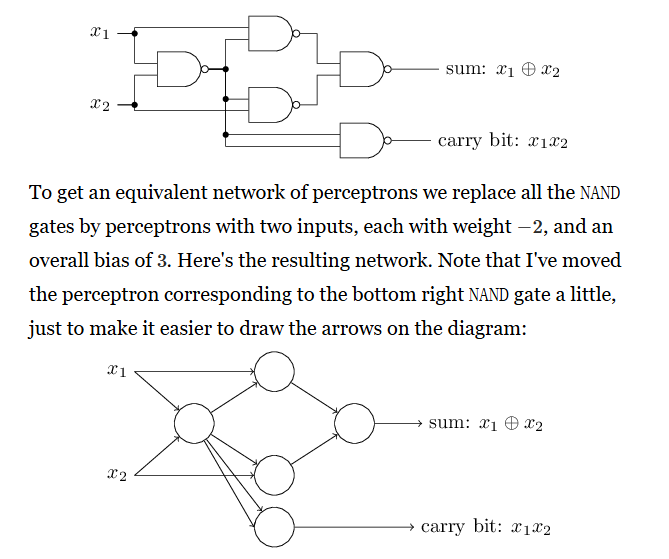
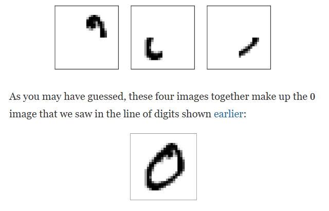

# Neural Network

## Examples

Rules are inferred in training examples.

## Perceptron

$$
output=\begin{cases}0\qquad if\sum_jw_jx_j\le threshold\ \\1\qquad if \sum_jw_jx_j>threshold\end{cases}
$$

Make decision by weighting up evidence. 和我之前基于人类判断的权重分析完全相同.
$$
output=\begin{cases}0\qquad if\ \bold w\cdot\bold x+b\le 0\ \\1\qquad if\ \bold w\cdot\bold x+b>0\end{cases}
$$
可以调整$weight$来实现逻辑门的功能.

使用$NAND$实现$AND,OR,NOT$.
$$
\overline{\overline{AB}\cdot \overline{AB}}=A B \\ \overline{AA}=\bar A \\ \overline{\overline{AA}\cdot \overline{BB}}=A+ B
$$
Small change in any weight or bias causes a small change in the output. This is $sigmod$ neuron.
$$
\sigma(z):=\frac{1}{1+e^{-z}}\in(0,1),\qquad z=wx+b
$$
当然也有$tanh$ neuron
$$
\tanh(z):=\frac{e^z-e^{-z}}{e^z+e^{-z}}\in(-1, 1)
$$
现在对其求导,采用隐函数
$$
\sigma(z)(1+e^{-z})=1 \\ \sigma'(z)(1+e^{-z})+\sigma(z)(-e^{-z})=0 \\ \sigma'(z)=\frac{e^{-z}}{(1+e^{-z})^2}=\frac{d\sigma}{dz} \\ \frac{dz}{dw}=\sum_jx_j,\\ d\sigma=k(\sum_jx_j+1)\frac{dwdb}{dw+db}\approx\sum_j\frac{\partial \sigma}{\partial w_j}dw+\frac{\partial\sigma}{\partial b}db
$$
:thinking:.

对于图像识别, input layer每个neruon对应一个像素. hidden layer每个neuron对应一种*模式*, output layer将不同模式结合起来获得结果.

尝试将10-output layer转换成4-output layer,即将十进制转换成二进制. 调整每个output neruon的权重来实现.

准备训练.定义损失函数$MSE$
$$
C(w,b):=\frac{1}{2n}\sum_x||y(x)-a||^2
$$
We need to minimize the cost. This is called *gradient descent*. **Smooth Function** matters. 离散函数难以优化.